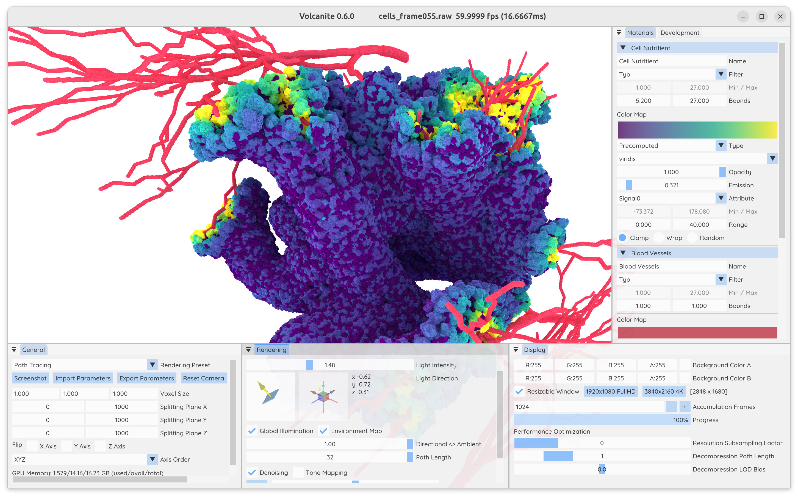

# Volcanite Segmentation Volume Renderer
[](https://gitlab.kit.edu/max.piochowiak/volcanite/-/tags/0.6.0)
[](https://www.gnu.org/licenses/gpl-3.0)
<!--[](https://www.doi.org/10.1109/TVCG.2023.3326573)-->

Volcanite is a GPU renderer for segmentation volumes implemented using C++ and the Vulkan API.
Segmentation volumes are voxel data sets that store an integer object label per voxel.
These volumes are commonly used in fields like connectomics, material science, computational biology, medicine, among others.
Volcanite uses a state-of-the-art [segmentation volume compression](https://cg.ivd.kit.edu/english/compsegvol.php) to
store large volume data sets in GPU memory during rendering.
Apart from interactively or non-interactively visualizing segmentation volumes, Volcanite can be used to compress data
sets at compression rates that generally outperforming other methods.


<sup>Data Set from *Emerging Tumor Development by Simulating Single-cell Events*, Rosenbauer J., Berghoff M., Schug A. (2020) bioRxiv</sup>

## Quick Start
See the setup guides for [Ubuntu / Debian](doc/Setup.md#ubuntu--debian) or [Windows](doc/Setup.md#windows) respectively for a more detailed description on how to install all dependencies and how to build Volcanite.
To install all required dependencies under Ubuntu, first install the [Vulkan SDK](https://vulkan.lunarg.com/sdk/home), the minimal build packages with
```bash
sudo apt install -y build-essential cmake xorg-dev
```
and optionally the `libhdf5-dev libvtk9-dev libtiff-dev libpugixml-dev` packages for compatibility with
a wider range of file formats*.
Build the `volcanite` executable with
```bash
mkdir cmake-build-release && cd cmake-build-release
cmake -DCMAKE_BUILD_TYPE=Release .. && cmake --build . -j --target volcanite
```

Start Volcanite, either providing a path to a segmentation volume as a commandline argument with
```bash
./volcanite/volcanite /path/to/your/segmentation/volume
```
or by using the file dialog to select a volume file.
If you have no segmentation volume at hand, you can create a synthetic dummy volume by passing `+synth` as input volume.
If your segmentation volume format is not supported by Volcanite, have a look at the [converter.py](../volcanite/python/converter.py) script to 
convert it into one of the supported file formats.

Run `./volcanite --help` for a complete list of arguments and commands.
See [Usage.md](doc/Usage.md#supported-segmentation-volume-file-formats) for a list of currently supported formats.
You can find a collection of example data sets listed in [ExampleData.md](doc/ExampleData.md).

**Note: due to an [incompatibility bug](https://gitlab.kitware.com/vtk/vtk/-/issues/19258) with the expat 2.6.0 library, libvtk9-dev versions before 9.3.1 are unable to
  open .vti XML files with binary encoding.*

## Documentation
The `doc` directory of this repository contains further information on how to use Volcanite:
* [Setup.md](doc/Setup.md) provides the setup guides for Linux and Windows systems and headless builds.
* [Usage.md](doc/Usage.md) contains the guide for using the Volcanite GUI application or command line interface.
* [ExampleData.md](doc/ExampleData.md) lists segmentation volumes that are publicly available and how to access them. 
* [Development.md](doc/Development.md) explains some rendering and compression algorithms and contains development guides.

## Python Module

The project contains a rudimentary python package to run volcanite confgiratuions through system calls, to download
large data sets from cloud storages, or to convert segmentation volumes between different file formats.
To install the package in a virtual environment, run
```bash
cd python
python3 -m venv .venv
source .venv/bin/activate
pip install ./volcanite[all]
```

## License
If not stated otherwise, the code in this repository uses a GPLv3 license.
If you require alternative licensing options, please contact the authors.
The third party open source libraries that Volcanite uses and their licenses are listed in
[Development.md](doc/Development.md#licenses).  

## About
Volcanite © 2024 Max Piochowiak, Reiner Dolp

Volcanite main contributors are [Max Piochowiak](https://cg.ivd.kit.edu/piochowiak/staff_index.php) and [Reiner Dolp](https://reinerdolp.com/).
Additional contributions by Fabian Schiekel, Patrick Jaberg, and [Mirco Werner](https://github.com/MircoWerner).
All contributors are affiliated with Karlsruhe Institute of Technology (KIT).
Volcanite builds on the CSGV segmentation volume compression and renderer by Max Piochowiak.
You can cite the following publication if you use the Volcanite CSGV compression in your projects:

```bibtex
@article{Piochowiak:2024:csgv,
    author={Piochowiak, Max and Dachsbacher, Carsten},
    journal={IEEE Transactions on Visualization and Computer Graphics}, 
    title={Fast Compressed Segmentation Volumes for Scientific Visualization}, 
    year={2024},
    volume={30},
    number={1},
    pages={12-22},
    doi={10.1109/TVCG.2023.3326573}
}
```

### Funding
This work has been supported by the Helmholtz Association (HGF) under the joint research school
“HIDSS4Health – Helmholtz Information and Data Science School for Health” and through the Pilot Project
Core Informatics.
